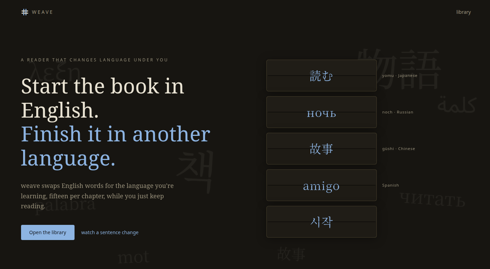
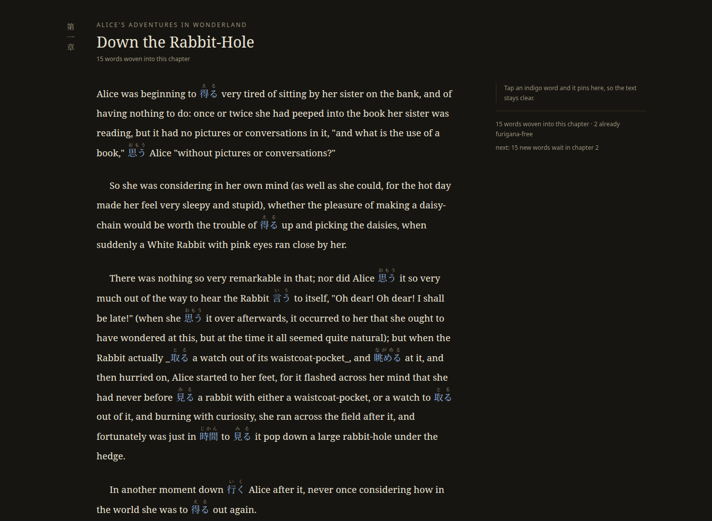

<div align="center">

<picture>
  <source media="(prefers-color-scheme: dark)" srcset="public/logomark.svg">
  
</picture>

# weave

**Start the book in English. Finish it in another language.**

A diglot-weave reader: real books whose words progressively swap into the
language you're learning, gated by FSRS flashcards, one chapter at a time.

[](LICENSE)



</div>

## How it works

1. **Fifteen words, then the chapter.** Each chapter starts as flashcards:
   its ~15 most useful words (most frequent first), scheduled by
   [FSRS](https://github.com/open-spaced-repetition/ts-fsrs), the algorithm
   behind Anki. The chapter opens for reading only when the cards are done -
   so every woven word is one you have already met.
2. **Read them in the wild.** The chapter arrives with those words woven in,
   indigo against the English, furigana printed above. Click one for its
   reading and meaning; every click is tracked and front-loads that word in
   review. On wide screens clicked words pin into a living margin so the text
   stays clear.
3. **The crutches fall away.** Old words keep returning as reviews alongside
   each chapter's new ones. Once a word's FSRS stability passes 7 days its
   furigana disappears. By the end of a book you are reading hundreds of
   words in context without help.

<div align="center">

<br><br>

</div>

## Run

```
npm install
npm run dev        # custom server on :5317 (next dev CLI exits when detached; server.js does not)
```

Japanese is on the loom first; the pipeline, data format, and UI take a
per-book `language` field, so other languages are a dictionary + transliterator
away, not a rewrite.

## Add a book

```
npm run weave-book -- <input>            # gutenberg id, url, or .txt path
npm run weave-book -- 55 --slug oz       # flags: --slug --title --lang
```

One command: fetch (Gutenberg header supplies the title), chapterize,
tokenize, resolve the lexicon, schedule introductions, and print a report.
Epub input needs pandoc (`pandoc book.epub -t plain -o book.txt`).

Chapter detection tries heading strategies in confidence order
(`CHAPTER IV.`, `CHAPTER 12`, `Chapter One`, `3. Title`, roman-only,
markdown) with TOC-cluster rejection, and falls back to even ~3000-word
parts when a book has no headings (`scripts/lib/chapterize.ts`).

Word resolution order per lexeme:

1. `data/books/<slug>/lexicon-overrides.json` - book-specific senses
2. `data/lexicon/<language>.json` - the global curated lexicon (grows with
   every book; each entry tagged `manual`/`reviewed`)
3. `data/lexicon/<language>-phrases.json` - curated multi-word units
   ("of course" weaves as one unit into もちろん / 当然), matched at ingest
   and never sent to the dictionary
4. dictionary reverse lookup - JMdict for Japanese (skips honorific/humble
   senses, penalizes katakana loanwords), CC-CEDICT for Mandarin
   (frequency-ranked, proper nouns rejected, tone-marked pinyin) -
   scheduled auto-picks that are common words or weak matches land in
   `data/books/<slug>/review-queue.json`

The curation loop: read the review queue, put fixes for wrong picks in
`data/lexicon/ja-corrections.json`, then
`npx tsx scripts/promote-reviewed.ts <slug>` folds the queue into the
global lexicon (corrections as `manual`, the rest as `reviewed`) and a
re-run of weave-book rebuilds clean. Coverage compounds: Alice needed a
full audit, Oz reused 47% of it, Peter Pan reused 62% and needed one fix.

JMdict JSON lives at `/data/dicts/jmdict-eng.json` (from
github.com/scriptin/jmdict-simplified, `jmdict-eng` release asset);
override with `$JMDICT`.

## Layout

- `scripts/ingest.ts` - book text -> tokenized chapters + candidate lexemes
- `scripts/build-lexicon.ts` - JMdict lookup + introduction schedule
- `data/books/<slug>/` - chapters/, meta, vocab, lexicon (committed; regenerable)
- `src/lib/` - db (better-sqlite3, `data/weave.db`), srs (ts-fsrs), book loading
- `src/app/` - library, `/read/[slug]/[n]`, `/review/[slug]/[n]`, api routes
- `server.js` - custom Next server entrypoint
- `tests/` - vitest (`npm test`); pool=forks because better-sqlite3 crashes worker threads

## License

Code is MIT (see `LICENSE`). Bundled data carries its own licenses:

- `data/lexicon/*.json` and the `lexicon.json` / `review-queue.json` files
  under `data/books/` contain Japanese glosses derived from
  [JMdict](https://www.edrdg.org/jmdict/j_jmdict.html), property of the
  Electronic Dictionary Research and Development Group, used under the
  group's [CC BY-SA 4.0 licence](https://www.edrdg.org/edrdg/licence.html)
  (via [jmdict-simplified](https://github.com/scriptin/jmdict-simplified)).
  These files are therefore CC BY-SA 4.0.
- `data/lexicon/zh*.json` and the corresponding files under `data/books/`
  contain Mandarin glosses derived from
  [CC-CEDICT](https://www.mdbg.net/chinese/dictionary?page=cc-cedict)
  (CC BY-SA 4.0). These files are therefore CC BY-SA 4.0.
- `data/raw/en_50k.txt` and `data/raw/zh_cn_50k.txt` are frequency lists from
  [hermitdave/FrequencyWords](https://github.com/hermitdave/FrequencyWords)
  (CC BY-SA 4.0, built from the OpenSubtitles corpus).
- The book texts under `data/raw/` and `data/books/` (Alice's Adventures in
  Wonderland, The Wonderful Wizard of Oz, Peter Pan) are public-domain works
  obtained from [Project Gutenberg](https://www.gutenberg.org/), with the
  Gutenberg boilerplate stripped.
- Spaced repetition is [ts-fsrs](https://github.com/open-spaced-repetition/ts-fsrs) (MIT).

## Future direction

- Deeper grammar-stage weaving: phrase-level swap units shipped ("of
  course" -> もちろん as one unit); next are word-order and particle swaps
  on the same token format.
- More languages: the adapter layer (`scripts/dict/`) takes a new language
  with one adapter (Spanish/Korean/French need a dictionary + scorer;
  the reader, scheduler, and pipeline are already language-agnostic).
